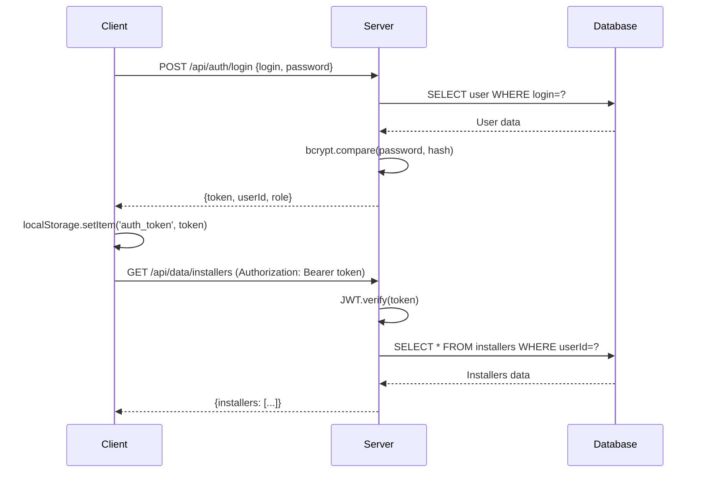

# 📋 Техническая Спецификация Canvia

**Версия:** 1.0  
**Дата:** 31 декабря 2025  
**Статус:** Production Ready

---

## 📖 Содержание

1. [Общее описание](#общее-описание)
2. [Архитектура системы](#архитектура-системы)
3. [Технологический стек](#технологический-стек)
4. [База данных](#база-данных)
5. [API Endpoints](#api-endpoints)
6. [Функциональность](#функциональность)
7. [Безопасность](#безопасность)
8. [Развертывание](#развертывание)
9. [Масштабирование](#масштабирование)

---

## 🎯 Общее описание

**Canvia** - веб-приложение для планирования логистики и управления монтажниками с визуальным канвас-интерфейсом.

### Основные возможности
- 👥 Многопользовательская работа с JWT авторизацией
- 📊 Визуальное планирование на канвасе
- 🔄 Синхронизация данных между устройствами в реальном времени
- 📱 Доступ с любого устройства в локальной сети
- 🎨 Управление статусами нарядов (Новый/В обработке/Выполнен)
- 🔗 Связывание монтажников с нарядами
- 📅 Работа с несколькими вкладками по датам

### Целевая аудитория
- Диспетчеры
- Руководители монтажных бригад
- Администраторы системы

---

## 🏗️ Архитектура системы

### Общая схема

```
┌─────────────────┐         ┌─────────────────┐         ┌─────────────────┐
│   Browser       │◄────────┤   Vite Dev      │◄────────┤   React App     │
│  (Client)       │  HTTP   │   Server        │  HMR    │   (Frontend)    │
│  Port: 8080     │         │   Port: 8080    │         │                 │
└────────┬────────┘         └─────────────────┘         └─────────────────┘
         │
         │ REST API (HTTP/JSON)
         │ JWT Bearer Token
         │
         ▼
┌─────────────────────────────────────────────────────────────────────────┐
│                          Express Server                                  │
│                          Port: 5000                                      │
│  ┌──────────────────────────────────────────────────────────────────┐  │
│  │  Middleware Layer                                                 │  │
│  │  - CORS (multi-origin support)                                   │  │
│  │  - JWT Authentication                                            │  │
│  │  - Request Logging                                               │  │
│  │  - JSON Validation                                               │  │
│  │  - Error Handling                                                │  │
│  └──────────────────────────────────────────────────────────────────┘  │
│  ┌──────────────────────────────────────────────────────────────────┐  │
│  │  API Routes                                                       │  │
│  │  - /api/auth    (authentication & user management)               │  │
│  │  - /api/data    (installers & orders)                           │  │
│  │  - /api/canvas  (tiles, connections, tabs)                      │  │
│  └──────────────────────────────────────────────────────────────────┘  │
└────────────────────────────────┬────────────────────────────────────────┘
                                 │
                                 ▼
                    ┌─────────────────────────┐
                    │   SQLite Database       │
                    │   profi-planner.db      │
                    │   - users               │
                    │   - installers          │
                    │   - orders              │
                    │   - tiles               │
                    │   - connections         │
                    │   - tab_states          │
                    └─────────────────────────┘
```

### Компоненты

#### Frontend (React SPA)
- **Технология**: React 18 + TypeScript
- **State Management**: Zustand
- **Styling**: Tailwind CSS
- **Icons**: Heroicons
- **Build Tool**: Vite

#### Backend (REST API)
- **Runtime**: Node.js + TypeScript
- **Framework**: Express.js
- **Database**: SQLite3
- **Authentication**: JWT + bcrypt

---

## 🛠️ Технологический стек

### Frontend Dependencies

```json
{
  "react": "^18.3.1",
  "react-dom": "^18.3.1",
  "zustand": "^5.0.2",
  "uuid": "^11.0.3",
  "@heroicons/react": "^2.2.0",
  "tailwindcss": "^3.4.17"
}
```

### Backend Dependencies

```json
{
  "express": "^4.21.2",
  "sqlite3": "^5.1.7",
  "bcryptjs": "^2.4.3",
  "jsonwebtoken": "^9.0.2",
  "cors": "^2.8.5",
  "dotenv": "^16.4.7",
  "uuid": "^11.0.3"
}
```

### Development Tools

```json
{
  "typescript": "~5.6.2",
  "vite": "^5.4.11",
  "tsx": "^4.19.2",
  "nodemon": "^3.1.9",
  "@types/node": "^22.10.2",
  "@types/express": "^5.0.0"
}
```

---

## 💾 База данных

### Схема данных

#### Таблица: `users`
```sql
CREATE TABLE users (
  id TEXT PRIMARY KEY,
  login TEXT UNIQUE NOT NULL,
  password TEXT NOT NULL,         -- bcrypt hash
  role TEXT DEFAULT 'user',       -- 'admin' | 'manager' | 'user'
  createdAt DATETIME DEFAULT CURRENT_TIMESTAMP
);
```

**Индексы:**
- `UNIQUE INDEX idx_users_login ON users(login)`

**Назначение:** Хранение учётных записей пользователей

---

#### Таблица: `installers`
```sql
CREATE TABLE installers (
  id TEXT PRIMARY KEY,
  userId TEXT NOT NULL,
  name TEXT NOT NULL,
  phone TEXT NOT NULL,
  status TEXT DEFAULT 'free',     -- 'free' | 'busy'
  createdAt DATETIME DEFAULT CURRENT_TIMESTAMP,
  FOREIGN KEY (userId) REFERENCES users(id)
);
```

**Индексы:**
- `INDEX idx_installers_userId ON installers(userId)`

**Назначение:** Справочник монтажников

---

#### Таблица: `orders`
```sql
CREATE TABLE orders (
  id TEXT PRIMARY KEY,
  userId TEXT,
  number TEXT UNIQUE,             -- авто-генерация, если пуст
  address TEXT,
  description TEXT,               -- раньше client
  deadline TEXT,
  status TEXT DEFAULT 'new',      -- 'new' | 'processing' | 'completed'
  shift TEXT DEFAULT 'day',       -- 'day' | 'evening' (смена)
  workDone TEXT DEFAULT '',       -- что сделано (заполняет и монтажник)
  createdBy TEXT,                 -- login создателя
  createdAt DATETIME DEFAULT CURRENT_TIMESTAMP,
  FOREIGN KEY (userId) REFERENCES users(id)
);
```

**Индексы:**
- `INDEX idx_orders_userId ON orders(userId)`
- `UNIQUE INDEX idx_orders_number ON orders(number)`
- `INDEX idx_orders_status ON orders(status)`

**Назначение:** Наряды/заказы на работу

---

#### Таблица: `tiles`
```sql
CREATE TABLE tiles (
  id TEXT PRIMARY KEY,
  userId TEXT,
  tabId TEXT NOT NULL,            -- date in format YYYY-MM-DD
  type TEXT NOT NULL,             -- 'installer' | 'order' | 'brigade'
  dataId TEXT NOT NULL,           -- FK to installers.id, orders.id or brigades.id
  x INTEGER DEFAULT 0,
  y INTEGER DEFAULT 0,
  groupId TEXT,                   -- группа (nullable)
  name TEXT,
  details TEXT,
  createdAt DATETIME DEFAULT CURRENT_TIMESTAMP,
  FOREIGN KEY (userId) REFERENCES users(id)
);
```

**Индексы:**
- `INDEX idx_tiles_userId_tabId ON tiles(userId, tabId)`
- `INDEX idx_tiles_dataId ON tiles(dataId)`

**Назначение:** Плитки на канвасе (монтажники, наряды, бригады)

---

#### Таблица: `connections`
```sql
CREATE TABLE connections (
  id TEXT PRIMARY KEY,
  userId TEXT NOT NULL,
  tabId TEXT NOT NULL,
  fromTileId TEXT NOT NULL,
  toTileId TEXT NOT NULL,
  createdAt DATETIME DEFAULT CURRENT_TIMESTAMP,
  FOREIGN KEY (userId) REFERENCES users(id),
  FOREIGN KEY (fromTileId) REFERENCES tiles(id) ON DELETE CASCADE,
  FOREIGN KEY (toTileId) REFERENCES tiles(id) ON DELETE CASCADE
);
```

**Индексы:**
- `INDEX idx_connections_userId_tabId ON connections(userId, tabId)`
- `INDEX idx_connections_tiles ON connections(fromTileId, toTileId)`

**Назначение:** Связи между плитками (назначение монтажников на наряды)

---

#### Таблица: `tab_states`
```sql
CREATE TABLE tab_states (
  id TEXT PRIMARY KEY,
  userId TEXT,
  date TEXT NOT NULL UNIQUE,      -- YYYY-MM-DD, общий реестр вкладок
  cameraX REAL DEFAULT 0,         -- legacy, больше не пишется
  cameraY REAL DEFAULT 0,         -- legacy, больше не пишется
  zoom REAL DEFAULT 1.0,          -- legacy, больше не пишется
  updatedAt DATETIME DEFAULT CURRENT_TIMESTAMP,
  FOREIGN KEY (userId) REFERENCES users(id)
);
```

**Назначение:** Реестр вкладок (дат). Обзор (камера/зум) — личный у каждого
зрителя, хранится в `localStorage` клиента (`canvia-camera`).

---

#### Таблица: `groups`
```sql
CREATE TABLE groups (
  id TEXT PRIMARY KEY,
  tabId TEXT NOT NULL,            -- дата YYYY-MM-DD (без FK)
  name TEXT NOT NULL,
  x REAL NOT NULL DEFAULT 0,
  y REAL NOT NULL DEFAULT 0,
  width REAL NOT NULL DEFAULT 200,
  height REAL NOT NULL DEFAULT 150,
  color TEXT DEFAULT '#6366f1',
  createdAt DATETIME DEFAULT CURRENT_TIMESTAMP
);
```

**Назначение:** Группы плиток на канвасе (рамка, перемещение целиком)

---

#### Таблицы: `brigades` + `brigade_members`
```sql
CREATE TABLE brigades (
  id TEXT PRIMARY KEY,
  userId TEXT,
  name TEXT NOT NULL,
  color TEXT DEFAULT '#10b981',
  createdAt DATETIME DEFAULT CURRENT_TIMESTAMP,
  FOREIGN KEY (userId) REFERENCES users(id)
);

CREATE TABLE brigade_members (
  id TEXT PRIMARY KEY,
  brigadeId TEXT NOT NULL,
  installerId TEXT NOT NULL,
  createdAt DATETIME DEFAULT CURRENT_TIMESTAMP,
  FOREIGN KEY (brigadeId) REFERENCES brigades(id) ON DELETE CASCADE,
  FOREIGN KEY (installerId) REFERENCES installers(id) ON DELETE CASCADE
);
```

**Назначение:** Бригады монтажников и их состав

---

## 🌐 API Endpoints

### Base URL
```
http://<hostname>:5000/api
```

### Authentication Flow



---

### 🔐 Auth Endpoints

#### POST `/api/auth/login`
**Описание:** Аутентификация пользователя

**Request:**
```json
{
  "login": "admin",
  "password": "admin"
}
```

**Response (200 OK):**
```json
{
  "success": true,
  "userId": "uuid",
  "login": "admin",
  "role": "admin",
  "token": "jwt.token.here",
  "expiresIn": "7d"
}
```

**Errors:**
- `401 Unauthorized` - Неверный логин или пароль
- `400 Bad Request` - Отсутствуют обязательные поля

---

#### POST `/api/auth/register` 🔒
**Описание:** Регистрация нового пользователя (только для администраторов)

**Headers:**
```
Authorization: Bearer <admin_token>
```

**Request:**
```json
{
  "login": "newuser",
  "password": "password123",
  "role": "user"
}
```

**Response (201 Created):**
```json
{
  "success": true,
  "user": {
    "id": "uuid",
    "login": "newuser",
    "role": "user"
  },
  "message": "User created successfully"
}
```

**Errors:**
- `403 Forbidden` - Нет прав администратора
- `409 Conflict` - Пользователь уже существует

---

#### GET `/api/auth/users` 🔒
**Описание:** Получить список всех пользователей (только для администраторов)

**Headers:**
```
Authorization: Bearer <admin_token>
```

**Response (200 OK):**
```json
{
  "success": true,
  "users": [
    {
      "id": "uuid",
      "login": "admin",
      "role": "admin"
    },
    {
      "id": "uuid2",
      "login": "user1",
      "role": "user"
    }
  ]
}
```

---

#### DELETE `/api/auth/users/:id` 🔒
**Описание:** Удалить пользователя (только для администраторов, нельзя удалить себя)

**Headers:**
```
Authorization: Bearer <admin_token>
```

**Response (200 OK):**
```json
{
  "success": true,
  "message": "User deleted successfully"
}
```

**Errors:**
- `403 Forbidden` - Попытка удалить самого себя
- `404 Not Found` - Пользователь не найден

---

#### POST `/api/auth/verify` 🔒
**Описание:** Проверить валидность JWT токена

**Headers:**
```
Authorization: Bearer <token>
```

**Response (200 OK):**
```json
{
  "success": true,
  "id": "uuid",
  "login": "admin",
  "role": "admin"
}
```

---

### 📊 Data Endpoints

#### GET `/api/data/installers` 🔒
**Описание:** Получить список монтажников текущего пользователя

**Response (200 OK):**
```json
{
  "success": true,
  "installers": [
    {
      "id": "uuid",
      "name": "Иван Иванов",
      "phone": "+79001234567",
      "status": "free",
      "createdAt": "2025-12-31T10:00:00Z"
    }
  ]
}
```

---

#### POST `/api/data/installers` 🔒
**Описание:** Создать нового монтажника

**Request:**
```json
{
  "name": "Петр Петров",
  "phone": "+79009876543",
  "status": "free"
}
```

**Response (201 Created):**
```json
{
  "success": true,
  "data": {
    "id": "uuid",
    "name": "Петр Петров",
    "phone": "+79009876543",
    "status": "free"
  }
}
```

---

#### PUT `/api/data/installers/:id` 🔒
**Описание:** Обновить данные монтажника

**Request:**
```json
{
  "name": "Петр Петров (обновлено)",
  "status": "busy"
}
```

---

#### DELETE `/api/data/installers/:id` 🔒
**Описание:** Удалить монтажника

---

#### GET `/api/data/orders` 🔒
**Описание:** Получить список нарядов

**Response:**
```json
{
  "success": true,
  "orders": [
    {
      "id": "uuid",
      "number": "2025-001",
      "address": "ул. Ленина, 10",
      "description": "Замена радиаторов",
      "deadline": "2025-12-31",
      "status": "new",
      "shift": "day",
      "workDone": "",
      "createdBy": "admin",
      "createdAt": "2025-12-30T10:00:00Z"
    }
  ]
}
```

---

#### POST `/api/data/orders` 🔒 (роль manager и выше)
**Описание:** Создать новый наряд (номер сгенерируется, если пуст)

**Request:**
```json
{
  "number": "2025-002",
  "address": "пр. Мира, 25",
  "description": "Установка котла",
  "deadline": "2026-01-05",
  "status": "new",
  "shift": "evening"
}
```

---

#### PUT `/api/data/orders/:id` 🔒 (роль manager и выше)
**Описание:** Обновить наряд (все поля, включая `shift` и `workDone`)

---

#### PATCH `/api/data/orders/:id` 🔒
**Описание:** Частичное обновление. Роль `user` (монтажник) может менять **только** `workDone`

**Request (монтажник):**
```json
{
  "workDone": "Поставили 3 радиатора"
}
```

---

#### DELETE `/api/data/orders/:id` 🔒 (роль manager и выше)
**Описание:** Удалить наряд

---

### 🎨 Canvas Endpoints

#### GET `/api/canvas/tabs` 🔒
**Описание:** Получить список вкладок (дат) пользователя

**Response:**
```json
{
  "success": true,
  "data": [
    {
      "id": "uuid",
      "date": "2025-12-31",
      "cameraX": 0,
      "cameraY": 0,
      "zoom": 1.0,
      "updatedAt": "2025-12-31T10:00:00Z"
    }
  ]
}
```

---

#### GET `/api/canvas/tiles?tabId=2025-12-31` 🔒
**Описание:** Получить плитки на указанной вкладке

**Response:**
```json
{
  "success": true,
  "data": [
    {
      "id": "uuid",
      "tabId": "2025-12-31",
      "type": "installer",
      "dataId": "installer-uuid",
      "x": 100,
      "y": 200,
      "createdAt": "2025-12-31T10:00:00Z"
    }
  ]
}
```

---

#### POST `/api/canvas/tiles` 🔒
**Описание:** Создать плитку

**Request:**
```json
{
  "tabId": "2025-12-31",
  "type": "order",
  "dataId": "order-uuid",
  "x": 300,
  "y": 400
}
```

---

#### PUT `/api/canvas/tiles/:id` 🔒
**Описание:** Обновить позицию плитки

**Request:**
```json
{
  "x": 350,
  "y": 450
}
```

---

#### DELETE `/api/canvas/tiles/:id` 🔒
**Описание:** Удалить плитку

---

#### GET `/api/canvas/connections?tabId=2025-12-31` 🔒
**Описание:** Получить связи на вкладке

**Response:**
```json
{
  "success": true,
  "data": [
    {
      "id": "uuid",
      "fromTileId": "tile1-uuid",
      "toTileId": "tile2-uuid",
      "createdAt": "2025-12-31T10:00:00Z"
    }
  ]
}
```

---

#### POST `/api/canvas/connections` 🔒
**Описание:** Создать связь между плитками

**Request:**
```json
{
  "fromTileId": "tile1-uuid",
  "toTileId": "tile2-uuid",
  "tabId": "2025-12-31"
}
```

---

#### DELETE `/api/canvas/connections/:id` 🔒 (роль manager и выше)
**Описание:** Удалить связь (крестик виден только manager/admin)

---

#### Группы 🔒
**Описание:** Рамки вокруг плиток (подробности — GROUPS_PROGRESS.md, TILE_MANAGEMENT.md)

- `GET /api/canvas/groups/:tabId` — все группы вкладки
- `POST /api/canvas/groups` — создать (с привязкой `tileIds`)
- `PUT /api/canvas/groups/:id` — частичное обновление
- `DELETE /api/canvas/groups/:id` — удалить (плитки остаются)
- `POST /api/canvas/groups/:id/tiles`, `DELETE /api/canvas/groups/:id/tiles/:tileId` — ±плитка

---

#### Бригады 🔒
**Описание:** Бригады монтажников

- `GET/POST /api/brigades`, `PUT/DELETE /api/brigades/:id` (изменение — manager и выше)
- `POST /api/brigades/find-or-create` — найти бригаду по составу
- `POST /api/brigades/:id/members` — добавить монтажника

---

#### Обзор канваса (удалено с сервера)
Эндпоинт `PUT /api/canvas/tab-state` **удалён**: обзор (камера/зум) — личный
у каждого зрителя, хранится в `localStorage` (`canvia-camera`).

---

## ⚙️ Функциональность

### Роли пользователей

#### Администратор (admin)
- ✅ Всё из прав менеджера
- ✅ Создание/удаление пользователей, смена ролей и паролей

#### Менеджер (manager)
- ✅ Создание/редактирование/удаление монтажников, нарядов, бригад
- ✅ Работа с канвасом (плитки, связи, группы, вкладки)
- ✅ Просмотр списка пользователей

#### Пользователь / монтажник (user)
- ✅ Просмотр канваса (плитки двигать нельзя)
- ✅ Заполнение «Что сделано» в наряде
- ✅ Создание связей (привязать себя к наряду)
- ❌ Удаление связей, плиток, справочников

---

### Функции канваса

#### Навигация
- **Панорамирование**: ЛКМ + перетаскивание фона, колесо — на тачпаде; на телефоне — палец
- **Зум**: колесо мыши к курсору, Ctrl+колесо — движение вверх/вниз, Shift+колесо — влево/вправо; щипок на телефоне; кнопки +/-
- **Сброс вида**: кнопка прицела
- **Тап по наряду на телефоне**: открыть редактирование

#### Плитки
- **Создание**: Кнопка + в хедере
- **Перемещение**: Перетаскивание плитки (роль user — нельзя)
- **Удаление**: Кнопка корзины на плитке (manager и выше)
- **Редактирование наряда**: Карандаш на плитке / тап по наряду на телефоне

#### Связи
- **Создание**: Кнопка связи на плитке → выбрать вторую плитку
- **Удаление**: Клик по центру связи
- **Отмена**: ESC

#### Статусы и смены нарядов
- 🔴 **Новый** / 🔵 **В обработке** / 🟢 **Выполнен**
- ☀️ **День** / 🌙 **Вечер** — смена (бейдж на плитке + фильтр в хедере)
- ✅ **Сделано** — отчёт о работе (виден на плитке, заполняет и монтажник)

---

## 🔒 Безопасность

### Аутентификация
- **JWT токены** с временем жизни 7 дней
- **Bcrypt** для хэширования паролей (10 раундов)
- Токен хранится в `localStorage` с ключом `authToken`
- SSE-стрим авторизуется токеном в query (`EventSource` не умеет заголовки)

### Авторизация
- Уровни `user (1) < manager (2) < admin (3)`: `requireRole` пропускает свой уровень и выше
- Middleware `requireAdmin` — только для управления пользователями
- Роль `user` в `PATCH /api/data/orders/:id` может менять только `workDone`

### CORS
- Динамическая валидация origin
- Разрешены localhost, локальные IP (192.168.x.x, 10.x.x.x, 172.x.x.x) на портах 8080/8081/5173
- Разрешены `*.keenetic.link` и `*.trycloudflare.com` (доступ монтажников по ссылке)

### Валидация данных
- Проверка обязательных полей
- Валидация типов данных
- Защита от SQL injection (параметризованные запросы)

### Обработка ошибок
Централизованная обработка через middleware:
- `ValidationError` (400)
- `UnauthorizedError` (401)
- `ForbiddenError` (403)
- `NotFoundError` (404)
- `AlreadyExistsError` (409)

---

## 🚀 Развертывание

### Требования к серверу
- **Node.js**: v18+ 
- **npm**: v9+
- **ОС**: Windows/Linux/macOS
- **Порты**: 5000 (API), 8080 (Frontend)
- **Память**: минимум 512MB RAM
- **Диск**: минимум 100MB

### Переменные окружения

**server/.env:**
```env
# Основные настройки
NODE_ENV=production
PORT=5000
HOST=0.0.0.0

# Безопасность
JWT_SECRET=your-super-secret-key-change-in-production
BCRYPT_ROUNDS=10

# База данных
DATABASE_PATH=./data/profi-planner.db

# Логирование
LOG_LEVEL=info
LOG_DIR=./logs

# CORS
CORS_ORIGIN=http://localhost:5173,http://localhost:8080
```

### Production Deployment

#### С использованием PM2

**1. Установка зависимостей:**
```bash
cd server && npm install --production
cd .. && npm install
```

**2. Сборка фронтенда:**
```bash
npm run build
```

**3. Настройка PM2:**

**ecosystem.config.js:**
```javascript
module.exports = {
  apps: [{
    name: 'profi-server',
    script: 'node',
    args: '--import tsx src/server.ts',
    cwd: './server',
    instances: 1,
    autorestart: true,
    watch: false,
    max_memory_restart: '500M',
    env: {
      NODE_ENV: 'production'
    }
  }]
};
```

**4. Запуск:**
```bash
pm2 start ecosystem.config.js
pm2 save
pm2 startup
```

#### С использованием Docker

**Dockerfile:**
```dockerfile
# Frontend build
FROM node:18-alpine AS frontend-build
WORKDIR /app
COPY package*.json ./
RUN npm ci
COPY . .
RUN npm run build

# Server
FROM node:18-alpine
WORKDIR /app
COPY --from=frontend-build /app/dist ./public
COPY server/package*.json ./server/
WORKDIR /app/server
RUN npm ci --production
COPY server/ .
EXPOSE 5000
CMD ["node", "--import", "tsx", "src/server.ts"]
```

**docker-compose.yml:**
```yaml
version: '3.8'
services:
  app:
    build: .
    ports:
      - "5000:5000"
    volumes:
      - ./data:/app/server/data
      - ./logs:/app/server/logs
    environment:
      - NODE_ENV=production
      - DATABASE_PATH=/app/server/data/profi-planner.db
    restart: unless-stopped
```

---

## 📈 Масштабирование

### Оптимизация производительности

#### Frontend
- **Code splitting** через динамические импорты
- **Lazy loading** для модалов
- **Debouncing** для camera updates
- **Memoization** для тяжёлых вычислений

#### Backend
- **Индексы БД** на часто запрашиваемых полях
- **Connection pooling** для SQLite
- **Кэширование** статических ресурсов
- **Gzip compression** для HTTP ответов

### Горизонтальное масштабирование

**Проблемы:**
- SQLite не поддерживает concurrent writes из нескольких процессов
- Session state хранится в памяти сервера

**Решения:**
1. Переход на PostgreSQL/MySQL для multi-instance deployment
2. Redis для session storage
3. Load balancer (Nginx) для распределения нагрузки

### Мониторинг

**Рекомендуемые метрики:**
- Response time на каждый endpoint
- Количество активных пользователей
- Размер базы данных
- Memory usage
- Error rate

**Инструменты:**
- PM2 monitoring
- Winston для логирования
- Prometheus + Grafana для метрик

---

## 🔧 Конфигурация

### Настройки сервера

**server/src/config.ts:**
```typescript
export const config = {
  port: parseInt(process.env.PORT || '5000'),
  host: process.env.HOST || '0.0.0.0',
  jwtSecret: process.env.JWT_SECRET || 'dev-secret',
  jwtExpiresIn: '7d',
  bcryptRounds: parseInt(process.env.BCRYPT_ROUNDS || '10'),
  databasePath: process.env.DATABASE_PATH || './data/profi-planner.db',
  corsOrigins: (process.env.CORS_ORIGIN || '').split(',').filter(Boolean)
};
```

### Настройки клиента

**vite.config.ts:**
```typescript
export default defineConfig({
  server: {
    host: '::',
    port: 8080,
    allowedHosts: ['.ngrok-free.app', '.ngrok.io']
  },
  build: {
    outDir: 'dist',
    sourcemap: true
  }
});
```

---

## 📝 Логирование

### Формат логов

**Access log:**
```
[2025-12-31T10:00:00.000Z] POST /api/auth/login - 200 - 150ms
[2025-12-31T10:00:05.000Z] GET /api/data/installers - 200 - 45ms
```

**Error log:**
```
[2025-12-31T10:00:10.000Z] ERROR: Unauthorized access attempt
  User: unknown
  IP: 192.168.1.100
  Endpoint: POST /api/auth/register
  Error: Missing JWT token
```

### Хранение логов
- **Путь**: `server/logs/`
- **Файлы**: 
  - `access.log` - все HTTP запросы
  - `error.log` - ошибки приложения
- **Ротация**: по достижению 10MB или раз в день

---

## 🧪 Тестирование

### Unit тесты
```bash
# Backend
cd server && npm test

# Frontend
npm test
```

### Integration тесты
```bash
npm run test:integration
```

### E2E тесты
```bash
npm run test:e2e
```

---

## 📚 API Версионирование

**Текущая версия:** v1

**URL структура:**
```
/api/v1/auth/login
/api/v1/data/installers
/api/v1/canvas/tiles
```

**Обратная совместимость:**
- Минорные изменения не ломают существующие клиенты
- Мажорные изменения требуют новой версии API (/api/v2/)

---

## 🔄 Backup & Recovery

### Backup базы данных

**Автоматический backup (cron):**
```bash
# Каждый день в 3:00
0 3 * * * cp /path/to/profi-planner.db /backups/profi-planner-$(date +\%Y\%m\%d).db
```

**Ручной backup:**
```bash
sqlite3 data/profi-planner.db ".backup data/backup.db"
```

### Recovery
```bash
cp /backups/profi-planner-20251231.db data/profi-planner.db
pm2 restart profi-server
```

---

## 📞 Поддержка

### Системные требования клиента
- **Браузер**: Chrome 90+, Firefox 88+, Safari 14+, Edge 90+
- **Разрешение**: минимум 1280x720
- **JavaScript**: включен
- **Cookies/LocalStorage**: включены

### Известные ограничения
- SQLite не поддерживает истинный concurrent access
- Максимальный размер БД: 140TB (практически не достижимо)
- Максимум одновременных подключений: ~1000 (зависит от сервера)

---

## 📄 Лицензия

Proprietary - All rights reserved

---

**Документ подготовлен:** 31 декабря 2025  
**Версия документа:** 1.0  
**Статус:** Актуально
